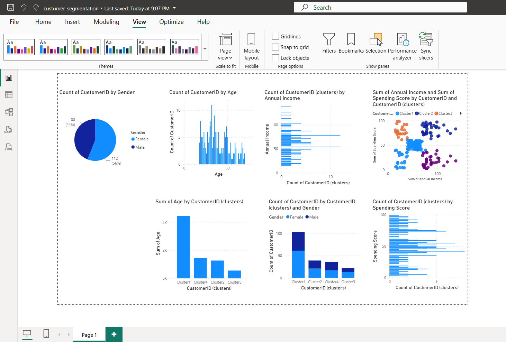

# Customer Segmentation using Power BI

## Objective
Segment customers based on their demographic and spending behavior using Power BI clustering techniques.

# --> Dataset
- Mall Customers Dataset
- 200 customer records

# --> Tools Used
- Power BI Desktop
- Microsoft Excel/CSV
- GitHub

# --> Methodology
1. Imported and cleaned the dataset.
2. Performed exploratory data analysis.
3. Created visualizations:
   - Gender Distribution
   - Age Distribution
   - Income vs Spending Scatter Plot
4. Applied clustering to segment customers.
5. Analyzed customer characteristics by cluster.

# --> Dashboard Visualizations
- Gender Distribution
- Age Distribution
- Scatter Plot with Clusters
- Average Income by Cluster
- Average Spending Score by Cluster
- Average Age by Cluster

# --> Key Insights
- High-income, high-spending customers are suitable targets for premium offerings.
- High-income, low-spending customers may respond to targeted promotions.
- Lower-income segments may benefit from value-based strategies.

## Dashboard Preview

